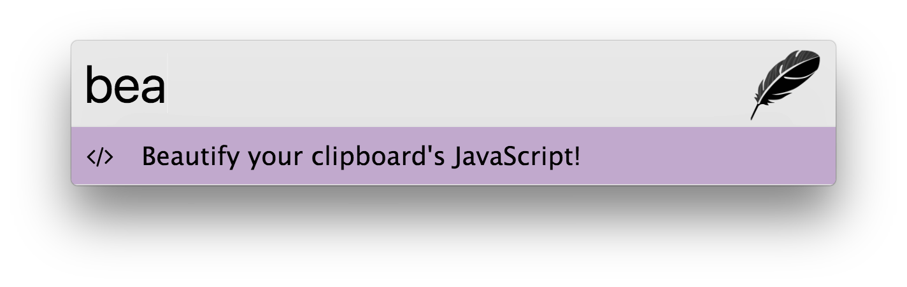

## Zazu JS Beautify

### Usage

Start typing the keyword `beautify` and we'll pull the JavaScript off your
clipboard, and copy the beautified JavaScript to the top of your clipboard.

### Installing

~~~ json
{
  "plugins": [
    "blainesch/zazu-js-beautify"
  ]
}
~~~
